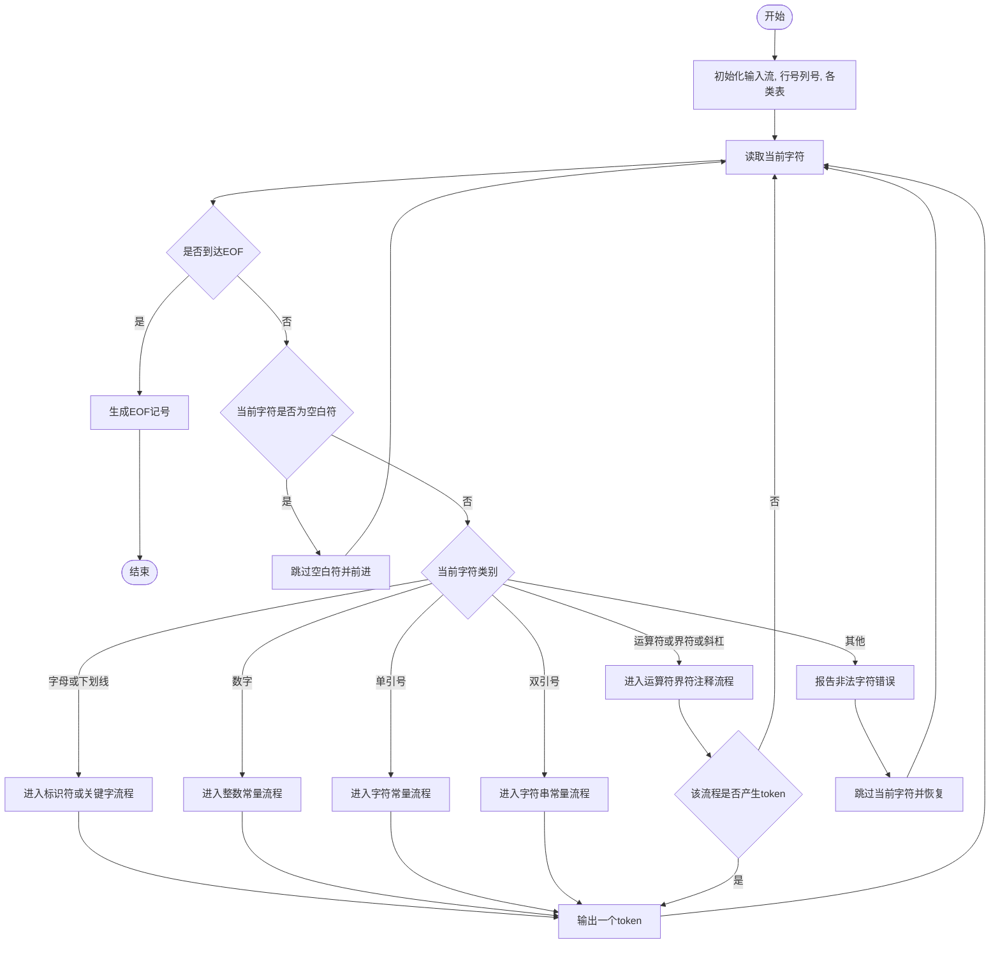
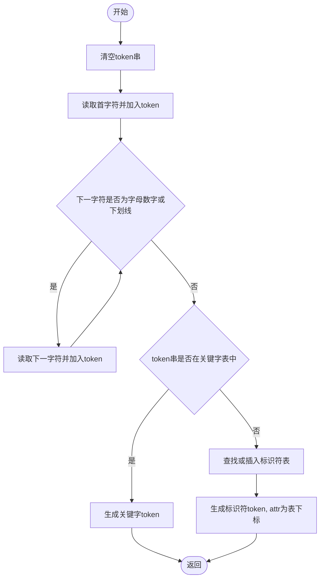
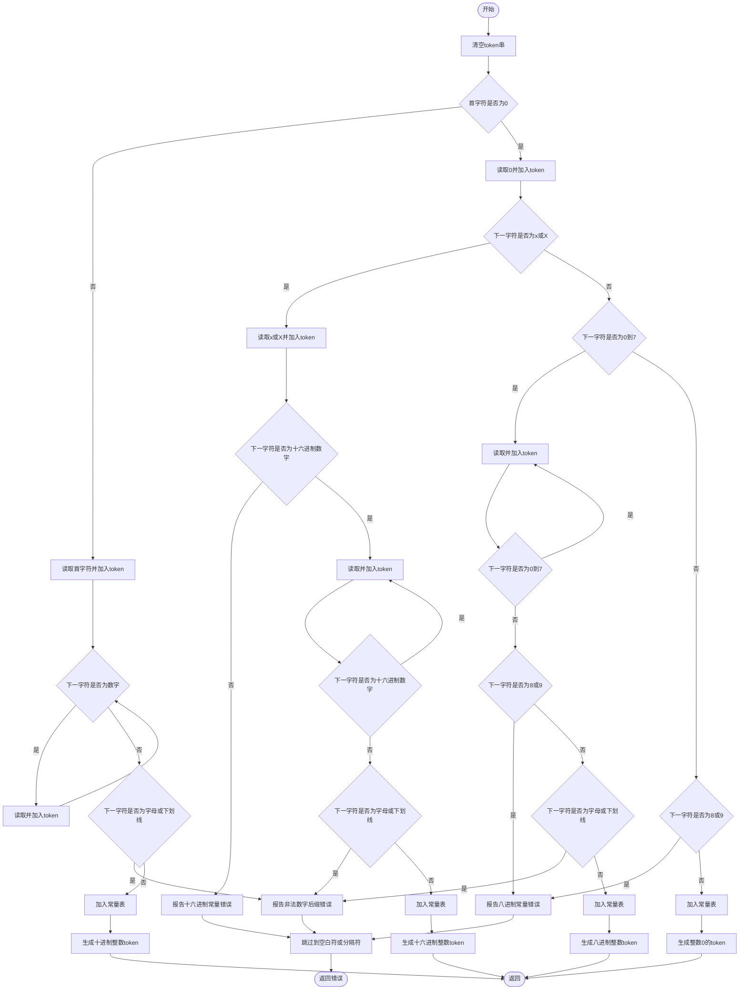
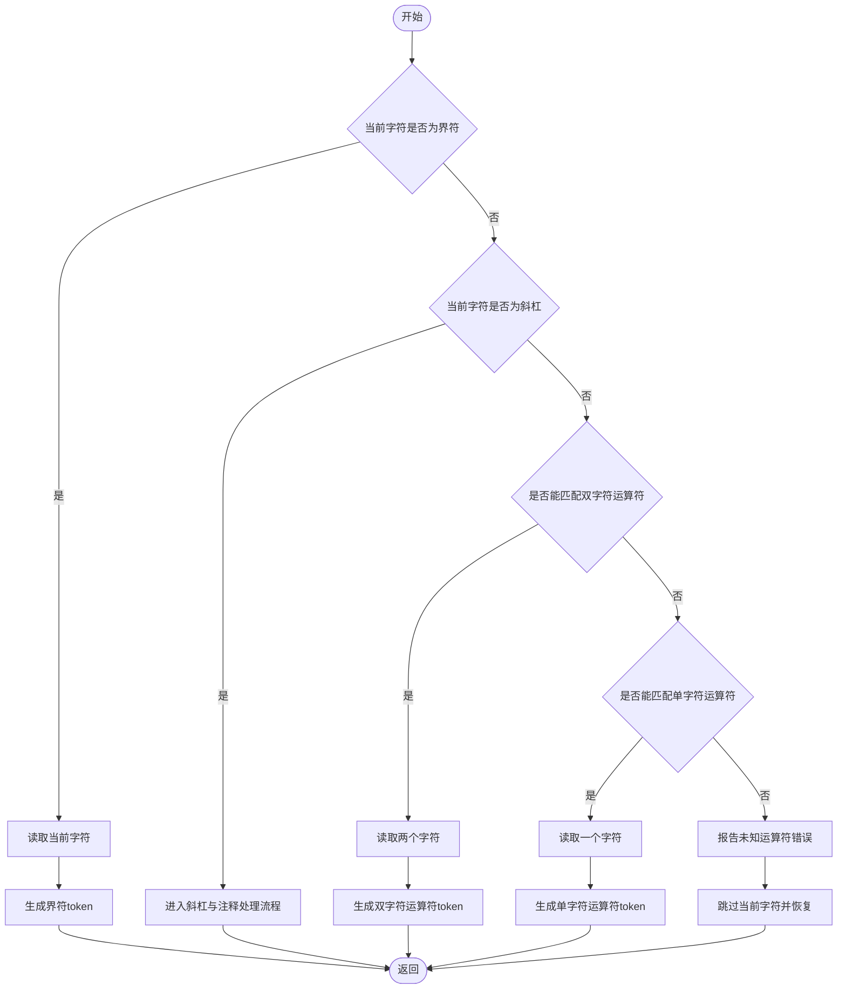
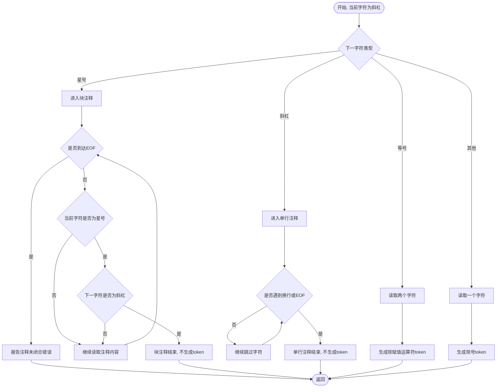
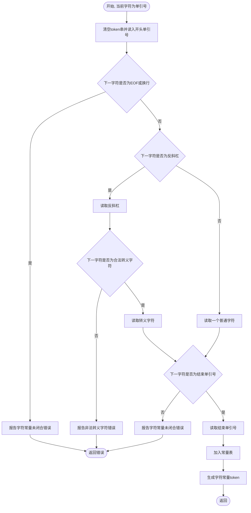
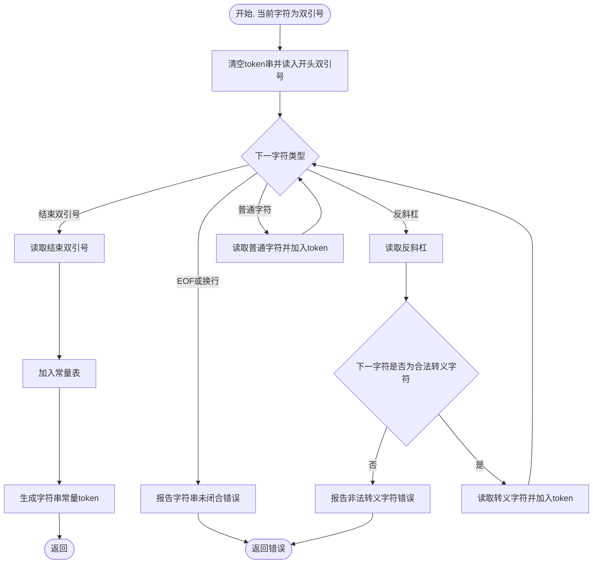

# 编译原理第 1 次实验-词法分析流程图

## 总控流程图

描述了整个词法分析器的入口逻辑。完成初始化后循环读入字符，遇到空白符就跳过，然后根据字符类别进入到不同的子流程。识别出一个 token 后，从子流程返回并继续扫描，直到 EOF 为止。

## 标识符/关键字子图

进入此流程时首字符已经确定是字母或下划线。先识别完整个标识符，然后查关键词表判定。

## 整数常量子图

首先判断首字符是否为 0，若不是则只能是十进制整数，否则进一步判断是八进制还是十六进制（或者就是整数 0）。任何数字结尾遇到字母或下划线（十六进制当然有一点点特别）就被视为非法后缀，报错。否则该数字已读完。

## 运算符/界限符子图

对于界限符，直接生成 token；对于斜杠，转入斜杠与注释处理流程；否则尝试运算符匹配，采用最长匹配原则：优先尝试双字符运算符，若没有匹配的，再尝试单字符运算符，都不行就报错。

## 注释子图

如果后面是另一个斜杠，进入单行注释，一直跳过直到换行或 EOF；若后面是 `*`，则进入块注释处理，匹配 `*/`，若遇到 EOF 则报错注释未闭合；若后面是 `=`，则生成 `/=` 运算符 token；否则，该 token 就是除号。

## 字符常量子图

此时已确定是单引号开头。遇到 EOF 或换行就报错字符常量未闭合；若是反斜杠可以在读一个字符判断是否为转义字符；否则应当只有一个普通字符，且接下来单引号应当闭合。

## 字符串常量子图

此时已确定是双引号开头。遇到 EOF 或换行报错未闭合；遇到结束双引号说明识别完成；遇到反斜杠开始判断是否构成合法转义字符；否则将普通字符加入 token，直到成功闭合。

