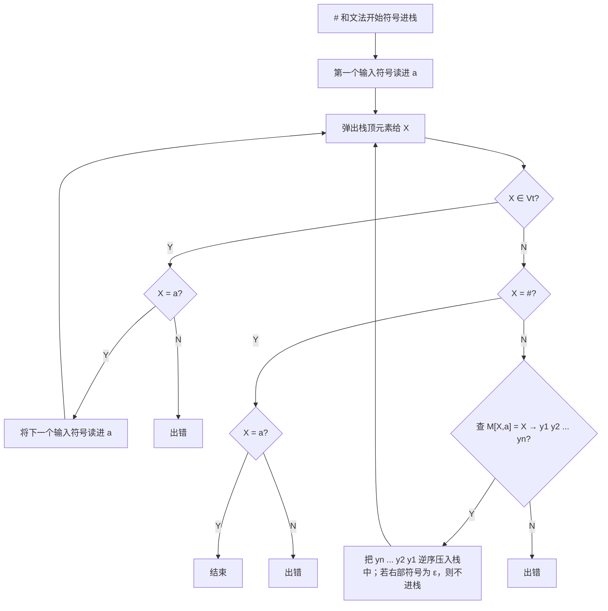

# Flowchart

书上图 4.4 "预测分析控制程序的流程图"：

```mermaid
flowchart TD
    A["# 和文法开始符号进栈"] --> B["第一个输入符号读进 a"]
    B --> C["弹出栈顶元素给 X"]

    C --> D{"X ∈ Vt?"}

    D -- "Y" --> E{"X = a?"}
    E -- "Y" --> F["将下一个输入符号读进 a"]
    F --> C
    E -- "N" --> G["出错"]

    D -- "N" --> H{"X = #?"}

    H -- "Y" --> I{"X = a?"}
    I -- "Y" --> J["结束"]
    I -- "N" --> K["出错"]

    H -- "N" --> L{"查 M[X,a] = X → y1 y2 ... yn?"}

    L -- "Y" --> M["把 yn ... y2 y1 逆序压入栈中；若右部符号为 ε，则不进栈"]
    M --> C

    L -- "N" --> N["出错"]
```